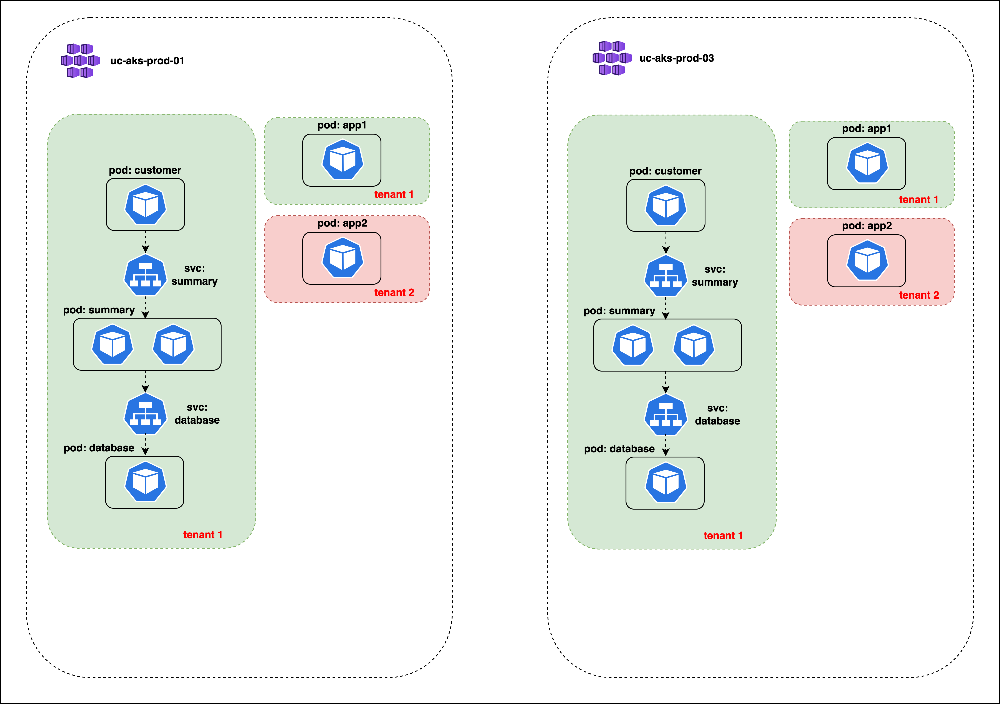
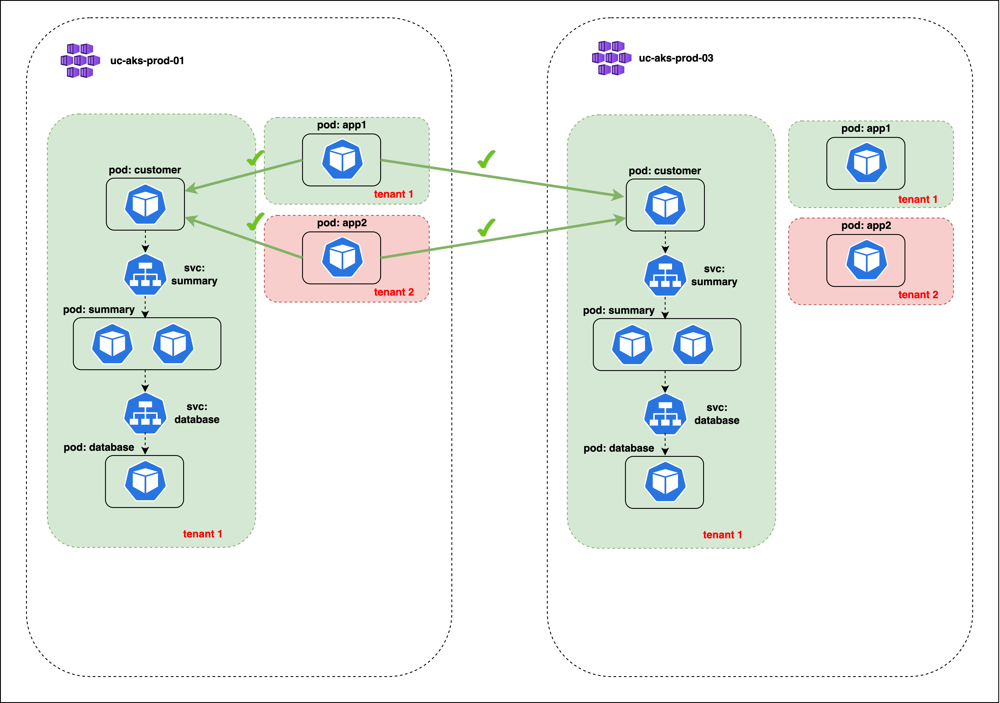
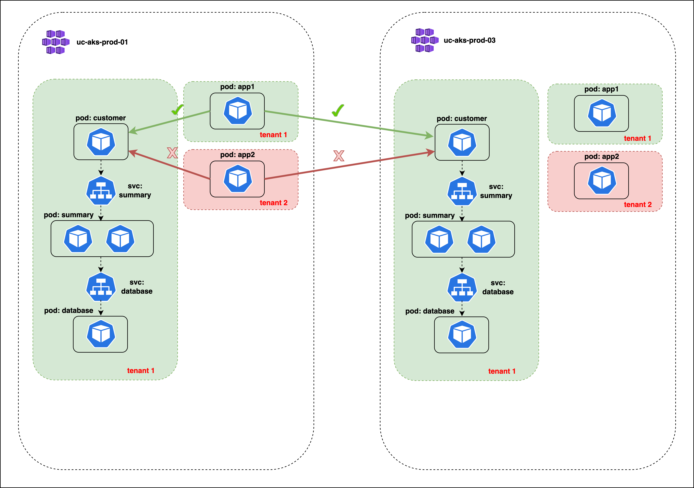
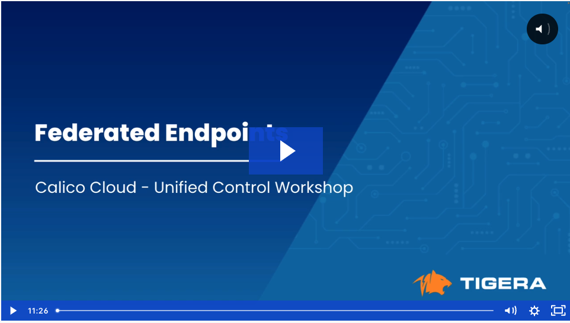

# Federated Endpoints

## Module Objectives

1. Understand how to implement security policies for federated endpoints
2. Understand the benefit of a consistent policy model across multiple federated clusters

## Module Tasks

1. Provision applications that belong to multiple tenants in cluster-01 and cluster-02
2. Deploy policies for tenant isolation using federated endpoints
3. Evaluate how policies are applied across federated clusters

## Lab Setup



## Deploy Applications - YAO Bank, APP1, and APP2

### Cluster-1

01. Deploy the YAO Bank Application

```bash
kubectl apply -f yaobank.yaml
```

02. Deploy the APP1 and APP2 Applications

```bash
kubectl apply -f app1app2.yaml
```

03. Verify deployments and services
Once complete verify the deployments and services. Further details can be found in the module video below. 

### Cluster-2

01. Deploy the YAO Bank Application

```bash
kubectl apply -f yaobank.yaml
```

02. Deploy the APP1 and APP2 Applications

```bash
kubectl apply -f app1app2.yaml
```
03. Verify deployments and services
Once complete verify the deployments and services. Further details can be found in the module video below. 

## Test Case - 1

### Test Connectivity to the Customer Service and Pod from the APP1 Pod in Cluster-1

#### 01. Exec into an APP1 pods in cluster-1

Retrieve the pod name
```bash
APP1_POD=$(kubectl get pod -n app1 --no-headers -o name | head -1) && echo $APP1_POD
```
Exec into the pod
```bash
kubectl exec -ti $APP1_POD -n app1 --sh
```

#### 02. Perform a CURL to the "customer" service in cluster-1 from the APP1 pod

```bash
curl customer.yaobank.svc.cluster.local
```
The CURL will successfully return the customer page

#### 03. Perform a CURL to the "customer" pod in cluster-2 from the APP1 pod in cluster-1

Retrieve the IP of the "customer" pod in cluster-2
```bash
kubectl get pods -n yaobank -o wide
```
Use the IP address to perform a CURL from the APP1 pod
```bash
curl [ip address]
```
### Test Connectivity to the Customer Service and Pod from the APP2 Pod in Cluster-1

#### 01. Exec into an APP2 pod in cluster-1

Retrieve the pod name
```bash
APP2_POD=$(kubectl get pod -n app2 --no-headers -o name | head -1) && echo $APP1_POD
```
Exec into the pod
```bash
kubectl exec -ti $APP2_POD -n app2 --sh
```

#### 02. Perform a CURL to the "customer" service in cluster-1 from the APP1 pod

```bash
curl customer.yaobank.svc.cluster.local
```
The CURL will successfully return the customer page

#### 03. Perform a CURL to the "customer" pod in cluster-2 from the APP1 pod in cluster-1

Retrieve the IP of the "customer" pod in cluster-2
```bash
kubectl get pods -n yaobank -o wide
```
Use the IP address to perform a CURL from the APP1 pod
```bash
curl [ip address]
```
The CURL will successfully return the customer page

### Test Case - 1 - Summary


## Isolate Tenant-1

### Cluster-1

01. Create tiers

```bash
kubectl apply -f tiers.yaml
```
02. Create Security Policy
Use the UI to create the below policy. The steps can be found in the module video.

```yaml
apiVersion: projectcalico.org/v3
kind: GlobalNetworkPolicy
metadata:
  name: platform.sp-tenant-1
spec:
  tier: platform
  order: 0
  selector: tenant == "tenant1"
  namespaceSelector: ''
  serviceAccountSelector: ''
  ingress:
    - action: Allow
      source:
        selector: tenant == "tenant1"
        namespaceSelector: all()
      destination: {}
    - action: Allow
      source:
        namespaceSelector: projectcalico.org/name == "kube-system"
      destination: {}
  egress:
    - action: Allow
      source: {}
      destination:
        selector: tenant == "tenant1"
        namespaceSelector: all()
    - action: Allow
      source: {}
      destination:
        namespaceSelector: projectcalico.org/name == "kube-system"
  doNotTrack: false
  applyOnForward: false
  preDNAT: false
  types:
    - Ingress
    - Egress
```

### Cluster-2

01. Create tiers

```bash
kubectl apply -f tiers.yaml
```

02. Create Security Policy
Use the UI to create the below policy. The steps can be found in the module video.

```yaml
apiVersion: projectcalico.org/v3
kind: GlobalNetworkPolicy
metadata:
  name: platform.sp-tenant-1
spec:
  tier: platform
  order: 0
  selector: tenant == "tenant1"
  namespaceSelector: ''
  serviceAccountSelector: ''
  ingress:
    - action: Allow
      source:
        selector: tenant == "tenant1"
        namespaceSelector: all()
      destination: {}
    - action: Allow
      source:
        namespaceSelector: projectcalico.org/name == "kube-system"
      destination: {}
  egress:
    - action: Allow
      source: {}
      destination:
        selector: tenant == "tenant1"
        namespaceSelector: all()
    - action: Allow
      source: {}
      destination:
        namespaceSelector: projectcalico.org/name == "kube-system"
  doNotTrack: false
  applyOnForward: false
  preDNAT: false
  types:
    - Ingress
    - Egress
```

## Test Case - 2

### Test Connectivity to the Customer Service and Pod from the APP1 Pod in Cluster-1

#### 01. Exec into an APP1 pods in cluster-1

Retrieve the pod name
```bash
APP1_POD=$(kubectl get pod -n app1 --no-headers -o name | head -1) && echo $APP1_POD
```
Exec into the pod
```bash
kubectl exec -ti $APP1_POD -n app1 --sh
```

#### 02. Perform a CURL to the "customer" service in cluster-1 from the APP1 pod

```bash
curl customer.yaobank.svc.cluster.local
```
The CURL will successfully return the customer page

#### 03. Perform a CURL to the "customer" pod in cluster-2 from the APP1 pod in cluster-1

Retrieve the IP of the "customer" pod in cluster-2
```bash
kubectl get pods -n yaobank -o wide
```
Use the IP address to perform a CURL from the APP1 pod
```bash
curl [ip address]
```
### Test Connectivity to the Customer Service and Pod from the APP2 Pod in Cluster-1

#### 01. Exec into an APP2 pod in cluster-1

Retrieve the pod name
```bash
APP2_POD=$(kubectl get pod -n app2 --no-headers -o name | head -1) && echo $APP1_POD
```
Exec into the pod
```bash
kubectl exec -ti $APP2_POD -n app2 --sh
```

#### 02. Perform a CURL to the "customer" service in cluster-1 from the APP2 pod

```bash
curl customer.yaobank.svc.cluster.local
```
The CURL from the APP2 pod will not be successful 

#### 03. Perform a CURL to the "customer" pod in cluster-2 from the APP2 pod in cluster-1

Retrieve the IP of the "customer" pod in cluster-2
```bash
kubectl get pods -n yaobank -o wide
```
Use the IP address to perform a CURL from the APP2 pod
```bash
curl [ip address]
```
The CURL from the APP2 pod will not be successful 

### Test Case - 2 - Summary



## Module Video
[](https://tigera.wistia.com/medias/t5znwissjs)
