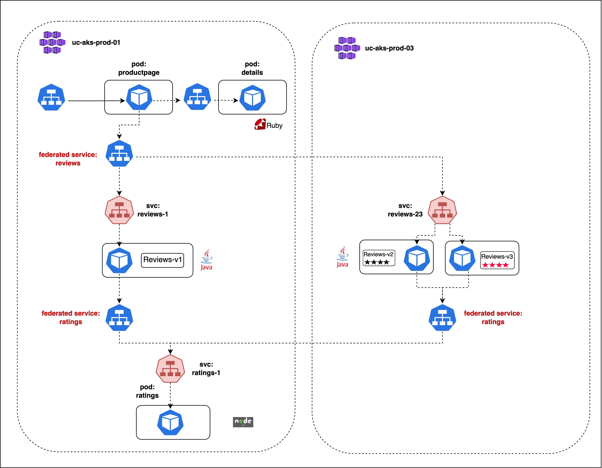
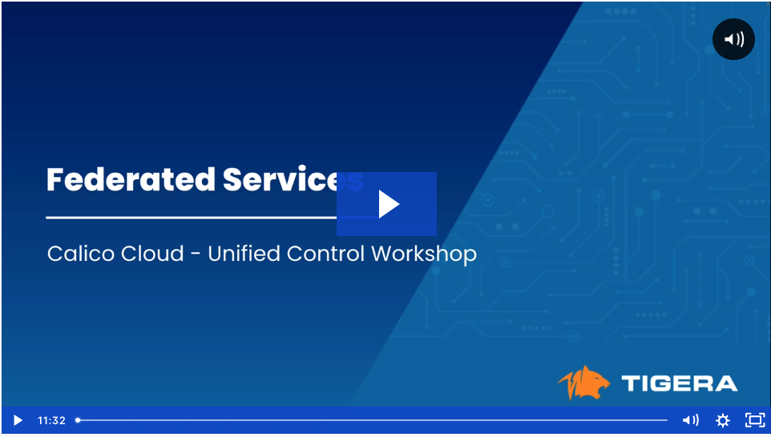

# Federated Services

## Module Objectives

1. Understand how to deploy microservices for a single application across multiple clusters
2. How to configure and validate Federated Service in Calico Cloud

## Module Tasks

1. Deploy microservices for the Bookinfo application spanning two clusters
2. Configure federated services for the application
3. Validate federated services
4. Test application functionality

## Lab Setup



## Deploy BookInfo Application

### Deploy the bookinfo application in cluster-1

1. Deploy bookinfo application

```bash
kubectl apply -f manifests/bookinfo/cluster-1/bookinfocluste01.yaml
```

2. Deploy ratings federated service

```bash
kubectl apply -f manifests/bookinfo/cluster-1/ratingsfederated.yaml
```

3. Deploy reviews federated service

```bash
kubectl apply -f manifests/bookinfo/cluster-1/reviewsfederated.yaml
```


### Deploy the bookinfo application in cluster-2

1. Deploy bookinfo application

```bash
kubectl apply -f manifests/bookinfo/cluster-2/bookinfocluster02.yaml
```

2. Deploy ratings federated services

```bash
kubectl apply -f manifests/bookinfo/cluster-2/ratingsfederated.yaml
```
## Test Federated Services
Look at the module video for testing the federated services. 

## Module Video
[](https://tigera.wistia.com/medias/s9a06bebnj)

