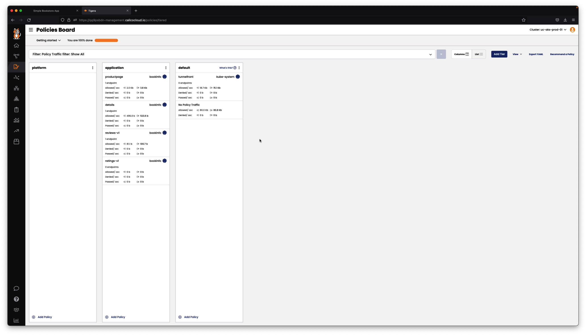
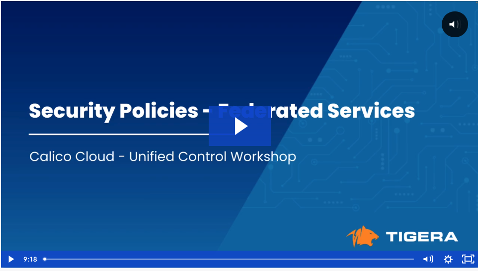

# Security Policies for Federated Services

## Module Objectives

1. Understand how to implement security policies for federated services deployed across multiple clusters
2. How the policy recommender generates policies using cloud-native attributes of local and remote deployments

## Module Tasks

1. Use the policy recommender to generate policies for the bookinfo deployments in cluster-01 and cluster-02
2. Test connectivity to bookinfo microservices once policies are implemented
3. Change policy behavior and test scenarios for traffic flows between deployments across cluster-01 and cluster-02

## Implement Policies Using the Policy Recommender

### Security Policies - CLuster-1

## Module Video

