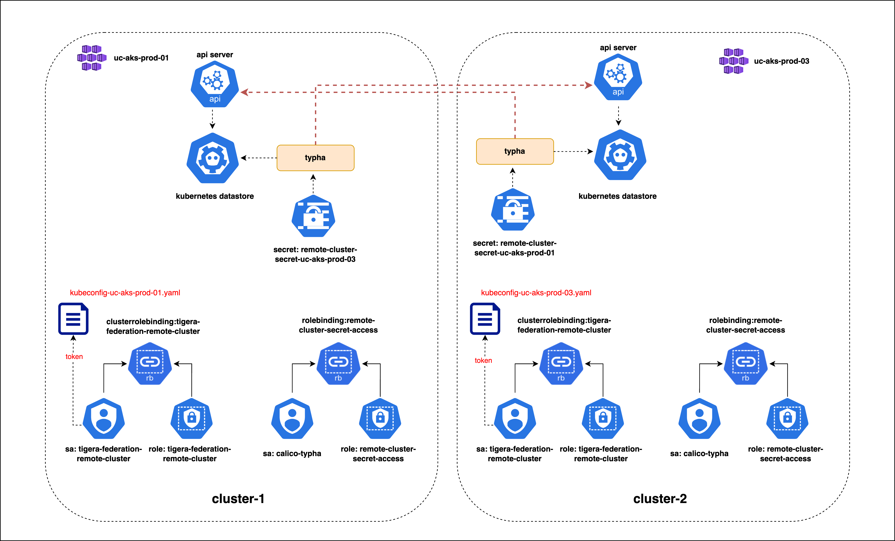
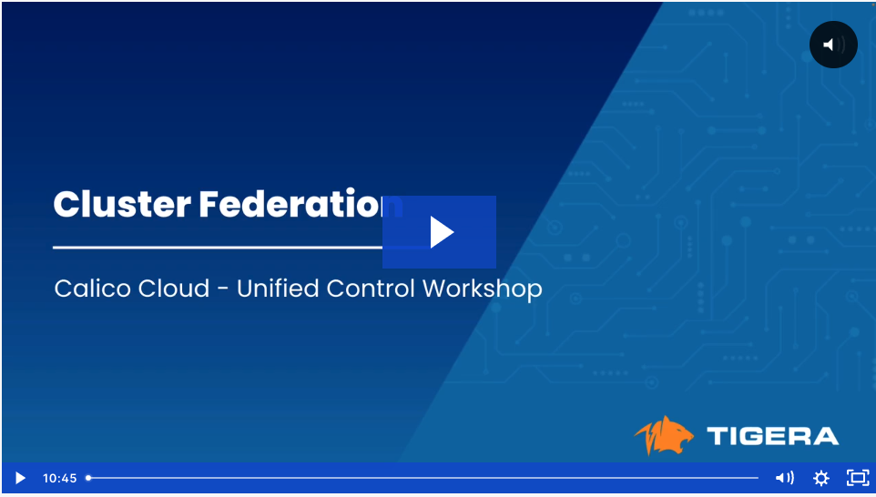

# Cluster Federation

## Module Objectives

01. Understand how clusters are federated using Calico Cloud
02. Understand the service accounts, roles, role bindings, and cluster role bindings required to federate clusters. 


## Module Tasks

01. Create tigera-federation-remote-cluster service accounts (SA)
02. Create kubeconfig file using the token from tigera-federation-remote-cluster SA
03. Create remote cluster secrets in local clusters using kubeconfig file of remote cluster
04. Assign RBAC required for the calico-typha SA to access the remote cluster secret
05. Create RemoteClusterConfiguration resource
06. Apply RBAC required for the tigera-federation-remote-cluster SA to access cluster resources
07. Use calicoq to validate federation


## Module Tasks Overview



## Create Kubeconfig Files

### Cluster-1 Kubeconfig File

01. Apply the following manifest to create a service account called tigera-federation-remote-cluster

```bash
kubectl apply -f 1.1-federation-remote-sa.yaml
```
02. Use the following command to retrieve the name of the secret containing the token associated with the tigera-federation-remote-cluster service account

```bash
kubectl describe serviceaccounts tigera-federation-remote-cluster -n kube-system
```
The value of Tokens is the name of the secret containing the service account’s token.

03. Use the following command to retrieve the token of the service account. Replace "[ID]" with the token ID retrieved in the above step.

```bash
kubectl describe secrets tigera-federation-remote-cluster-token-[ID] -n kube-system
```


```yaml
apiVersion: v1
kind: Config
users:
- name: tigera-federation-remote-cluster
  user:
    token: <YOUR-SERVICE-ACCOUNT-TOKEN>
clusters:
- name: tigera-federation-remote-cluster
  cluster:
    certificate-authority-data: <YOUR-CERTIFICATE-AUTHORITY-DATA>
    server: <YOUR-SERVER-ADDRESS>
contexts:
- name: tigera-federation-remote-cluster-ctx
  context:
    cluster: tigera-federation-remote-cluster
    user: tigera-federation-remote-cluster
current-context: tigera-federation-remote-cluster-ctx
```

### Cluster-2 Kubeconfig File

01. Apply the following manifest to create a service account called tigera-federation-remote-cluster

```bash
kubectl apply -f 2.1-federation-remote-sa.yaml
```
02. Use the following command to retrieve the name of the secret containing the token associated with the tigera-federation-remote-cluster service account

```bash
kubectl describe serviceaccounts tigera-federation-remote-cluster -n kube-system
```
The value of Tokens is the name of the secret containing the service account’s token.

03. Use the following command to retrieve the token of the service account. Replace "[ID]" with the token ID retrieved in the above step.

```bash
kubectl describe secrets tigera-federation-remote-cluster-token-[ID] -n kube-system
```


```yaml
apiVersion: v1
kind: Config
users:
- name: tigera-federation-remote-cluster
  user:
    token: <YOUR-SERVICE-ACCOUNT-TOKEN>
clusters:
- name: tigera-federation-remote-cluster
  cluster:
    certificate-authority-data: <YOUR-CERTIFICATE-AUTHORITY-DATA>
    server: <YOUR-SERVER-ADDRESS>
contexts:
- name: tigera-federation-remote-cluster-ctx
  context:
    cluster: tigera-federation-remote-cluster
    user: tigera-federation-remote-cluster
current-context: tigera-federation-remote-cluster-ctx
```


## Create Remote Cluster Secret and Remote Cluster Configuration

### Cluster-1

01. Create remote cluster secret

```bash
kubectl create secret generic remote-cluster-secret-uc-aks-prod-03 -n calico-system \
    --from-literal=datastoreType=kubernetes \
    --from-file=kubeconfig=../2-uc-aks-prod-03/2.2-kubeconfig-uc-aks-prod-03.yaml
```

02. Create RBAC for remote cluster secret

```bash
kubectl apply -f 1.3-rbac.yaml
```

03. Create remote cluster configuration
```bash
kubectl apply -f 1.4-remoteclusterconfiguration.yaml
```

04. Apply RBAC for tigera-federation-remote-cluster sa
```bash
kubectl apply -f 1.5-rbac-sa.yaml
```

### Cluster-2

01. Create remote cluster secret

```bash
kubectl create secret generic remote-cluster-secret-uc-aks-prod-01 -n calico-system \
    --from-literal=datastoreType=kubernetes \
    --from-file=kubeconfig=../1-uc-aks-prod-01/1.2-kubeconfig-uc-aks-prod-01.yaml
```

02. Create RBAC for remote cluster secret

```bash
kubectl apply -f 2.3-rbac.yaml
```

03. Create remote cluster configuration
```bash
kubectl apply -f 2.4-remoteclusterconfiguration.yaml
```

04. Apply RBAC for tigera-federation-remote-cluster sa
```bash
kubectl apply -f 2.5-rbac-sa.yaml
```

## Module Video

[](https://tigera.wistia.com/medias/0ym0e548z7)
