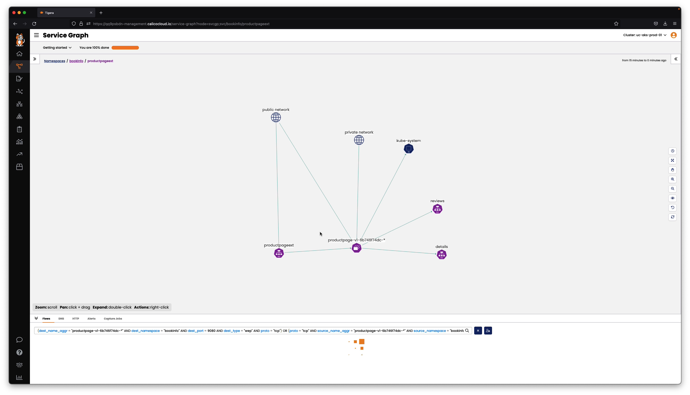

# Observability for Federated Services

## Module Objectives

1. Understand observability features in Calico Cloud for federated services

## Module Tasks

1. Navigate to the service graph in cluster-1 and cluster-2
2. Evaluate deployments, services, and traffic flows between them
3. Look at how federated services are depicted in the service graph

## Service Graph

### Cluster-1 Deployments and Federated Services
Analyze how the deployments, services and remote cluster endpoints are depicted in the service graph of cluster-1

#### <b>01. View - bookinfo namespace cluster-1</b>

#### 02. View - productpageext service

#### 03. View - reviews federated service

### Cluster-2 Deployments and Federated Services
Analyze how the deployments, services and remote cluster endpoints are depicted in the service graph of cluster-2

#### 01. View - bookinfo namespace cluster-2

#### 02. View - ratings federated service

## Module Video

